# MODEL dan ELOQUENT ORM

> Nama : Ahmad Aria Adi Saputra <br>
> NIM : 2241720247 <br>
> Kelas / No. : TI-2H / 02

### Praktikum 1 - $fillable:

#### 1. $fillable

1. Buka file model dengan nama UserModel.php dan tambahkan $fillable seperti gambar di bawah ini

```php

namespace App\Models;

use Illuminate\Database\Eloquent\Factories\HasFactory;
use Illuminate\Database\Eloquent\Model;

class User extends Model
{
    use HasFactory;

    protected $table = 'm_user';
    protected $primaryKey = 'user_id';

    protected $fillable = ['level_id', 'username', 'nama', 'password'];
}
```

2. Buka file controller dengan nama UserController.php dan ubah script untuk
   menambahkan data baru seperti gambar di bawah ini

```php
namespace App\Http\Controllers;

use Illuminate\Http\Request;
use App\Models\User;
use Illuminate\Support\Facades\Hash;

class UserController extends Controller
{
    function index() {
        $data = [
            'level_id' => 2,
            'username' => 'manager_dua',
            'nama' => 'Manager 2',
            'password' => Hash::make('12345')
        ];
        UserModel::create($data);

        $user = UserModel::all();
        return view('user', ['data' => $user]);
    }
}
```

3. Simpan kode program Langkah 1 dan 2, dan jalankan perintah web server. Kemudian jalankan link localhostPWL_POS/public/user pada browser dan amati apa yang terjadi<br>
   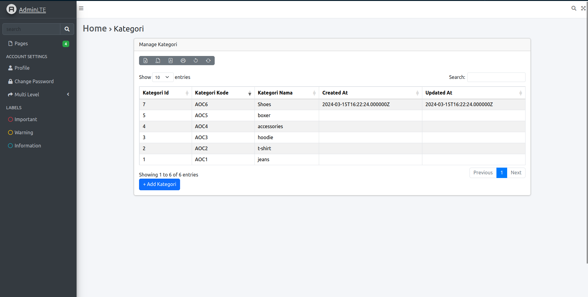<br>
4. Ubah file model UserModel.php seperti pada gambar di bawah ini pada bagian
   $fillable

```php
namespace App\Models;

use Illuminate\Database\Eloquent\Factories\HasFactory;
use Illuminate\Database\Eloquent\Model;

class User extends Model
{
    use HasFactory;

    protected $table = 'm_user';
    protected $primaryKey = 'user_id';

    protected $fillable = ['level_id', 'username', 'nama'];
}
```

5. Ubah kembali file controller UserController.php seperti pada gambar di bawah hanya bagian array pada $data

```php
namespace App\Http\Controllers;

use Illuminate\Http\Request;
use App\Models\User;
use Illuminate\Support\Facades\Hash;

class UserController extends Controller
{
    function index() {
        $data = [
            'level_id' => 2,
            'username' => 'manager_tiga',
            'nama' => 'Manager 3',
            'password' => Hash::make('12345')
        ];
        UserModel::create($data);

        $user = UserModel::all();
        return view('user', ['data' => $user]);
    }
}

```

6. Simpan kode program Langkah 4 dan 5. Kemudian jalankan pada browser dan amati apa yang terjadi <br>
   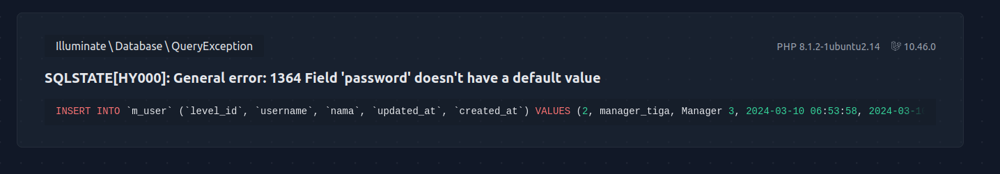<br>
   Setelah dilakukan modifikasi di UserController.php akan membuat error seperti diatas, karena $fillable ‘password’ dihilangkan dan kita melakukan insert data yang memiliki ‘password’ sehingga terjadi error. Perlu ditambahkan $fillable ‘password’ lagi agar bisa menambahkan data. Berikut adalah hasil akhirnya: <br> 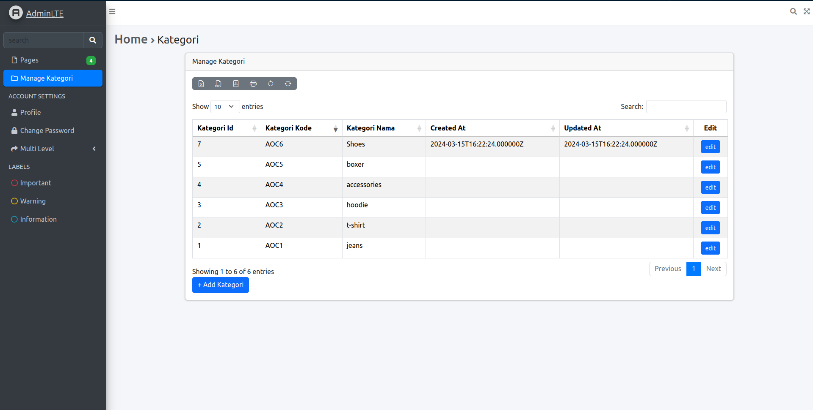<br>

#### 2. $guarded

Kebalikan dari $fillable adalah $guarded. Semua kolom yang kita tambahkan ke $guarded
akan diabaikan oleh Eloquent ketika kita melakukan insert/update. Secara default $guarded
isinya array("\*"), yang berarti semua atribut tidak bisa diset melalui mass assignment
(jabarkan istilah ini). <br> > Mass assignment adalah proses ketika Anda mengatur nilai atribut model menggunakan array asosiatif, seperti saat menggunakan create() atau update() method pada model.

### Praktikum 2.1 – Retrieving Single Models

1. Buka file controller dengan nama UserController.php dan ubah script seperti gambar
   di bawah ini

```php
namespace App\Http\Controllers;

use Illuminate\Http\Request;
use App\Models\User;
use Illuminate\Support\Facades\Hash;

class UserController extends Controller
{
    function index() {
        $user = UserModel::find(1);
        return view('user', ['data' => $user]);
    }
}
```

2. Buka file view dengan nama user.blade.php dan ubah script seperti gambar di bawah ini

```php
<tr>
    <td>{{$data->user_id}}</td>
    <td>{{$data->username}}</td>
    <td>{{$data->nama}}</td>
    <td>{{$data->level_id}}</td>
</tr>
```

3. amati apa yang terjadi dan beri penjelasan
   dalam laporan <br>
   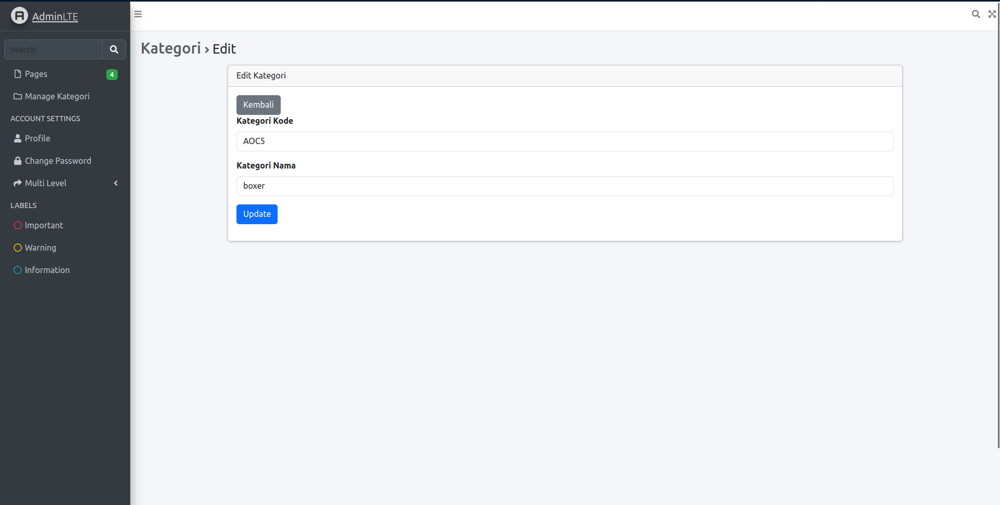<br>
    > Perbedaannya adalah $user = UserModel::find(1); Akan mencari user dengan ID 1
4. Ubah file controller dengan nama UserController.php dan ubah script seperti gambar
   di bawah ini

```php
namespace App\Http\Controllers;

use Illuminate\Http\Request;
use App\Models\User;
use Illuminate\Support\Facades\Hash;

class UserController extends Controller
{
    function index() {
        $user = UserModel::where('level_id', 1)->first();
        return view('user', ['data' => $user]);
    }
}
```

5. amati apa yang terjadi dan beri penjelasan dalam laporan <br>
   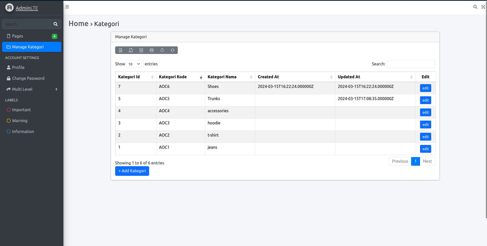<br>
    > $user = UserModel::where('level_id',1)->first(); Akan mencari user sesuai kriteria yang ditentukan karena menggunakan where. Setelah itu jika ada beberapa record akan dipilih yang pertama karena menggunakan first.
6. Ubah file controller dengan nama UserController.php dan ubah script seperti gambar
   di bawah ini

```php
namespace App\Http\Controllers;

use Illuminate\Http\Request;
use App\Models\User;
use Illuminate\Support\Facades\Hash;

class UserController extends Controller
{
    function index() {
        $user = UserModel::firstWhere('level_id', 1);
        return view('user', ['data' => $user]);
    }
}
```

7. amati apa yang terjadi dan beri penjelasan dalam laporan<br>
   (/public/ss/dt.png)<br>
    > $user = UserModel::firstWhere('level_id',1); Mirip dengan cara sebelumnya, bedanya cara ini akan langsung mencari record pertama yang memenuhi kondisi karena menggunakan gabungan first dan Where.
8. Ubah file controller dengan nama UserController.php dan ubah script seperti gambar di bawah ini

```php
namespace App\Http\Controllers;

use Illuminate\Http\Request;
use App\Models\User;
use Illuminate\Support\Facades\Hash;

class UserController extends Controller
{
    function index()
    {
        $user = UserModel::findOr(1, ['username', 'nama'], function () {
            abort(404);
        });
        return view('user', ['data' => $user]);
    }
}
```

9. amati apa yang terjadi dan beri penjelasan dalam laporan<br>
   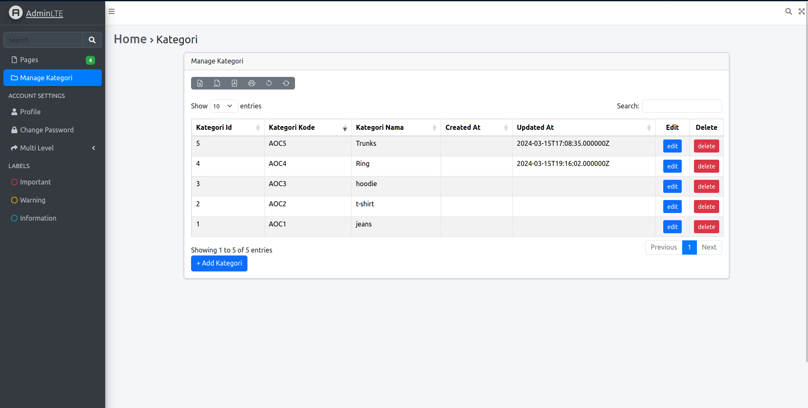<br>
    > Hanya muncul username dan nama karena kita hanya memberi perintah findOr untuk mencari ‘username’ dan ‘nama’ yang memiliki ID bernilai 1. Jika tidak ditemukan akan memunculkan error kode 404.
10. Ubah file controller dengan nama UserController.php dan ubah script seperti gambar di bawah ini

```php
namespace App\Http\Controllers;

use Illuminate\Http\Request;
use App\Models\User;
use Illuminate\Support\Facades\Hash;

class UserController extends Controller
{
    function index()
    {
        $user = UserModel::findOr(20, ['username', 'nama'], function () {
            abort(404);
        });
        return view('user', ['data' => $user]);
    }
}
```

11. amati apa yang terjadi dan beri penjelasan dalam laporan <br>
    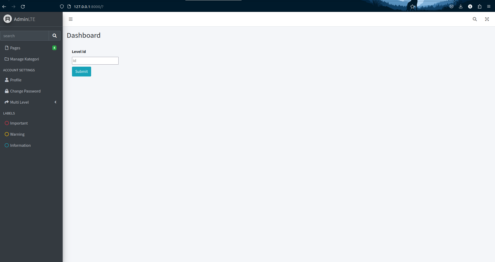<br>
    > Akan menghasilkan error 404 karena data dengan id 20 tidak ditemukan

### Praktikum 2.2 – Not Found Exceptions

1. Ubah file controller dengan nama UserController.php dan ubah script seperti gambar
   di bawah ini

```php
namespace App\Http\Controllers;

use Illuminate\Http\Request;
use App\Models\User;
use Illuminate\Support\Facades\Hash;

class UserController extends Controller
{
    function index()
    {
        $user = UserModel::findOrFail(1);
        return view('user', ['data' => $user]);
    }
}
```

2. amati apa yang
   terjadi dan beri penjelasan dalam laporan <br>
   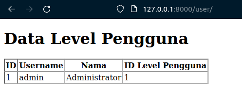
    > Dijalankan findOrFail(1) yang akan mencari record berdasarkan primary keynya, di kasus ini 1. Jika tidak ditemukan atau fail akan return page 404.
3. Ubah file controller dengan nama UserController.php dan ubah script seperti gambar
   di bawah ini

```php
namespace App\Http\Controllers;

use Illuminate\Http\Request;
use App\Models\User;
use Illuminate\Support\Facades\Hash;

class UserController extends Controller
{
    function index()
    {
        $user = UserModel::where('username', 'manager9')->firstOrFail();
        return view('user', ['data' => $user]);
    }
}
```

4. amati apa yang
   terjadi dan beri penjelasan dalam laporan <br>
   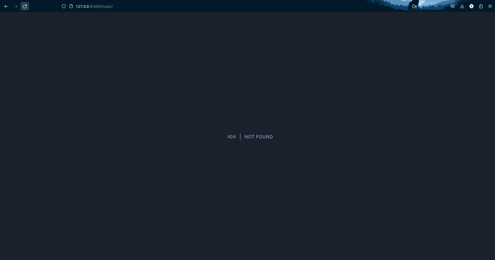
   <br>
    > Setelah dijalankan akan menampilkan error 404 karena menggunakan firstOrFail. Metode ini akan mencari record pertama apakah cocok dengan kondisi, jika tidak akan return error. Di kasus ini record pertama bukanlah manager9 sehingga error terjadi.

### Praktikum 2.3 – Retreiving Aggregrates

1.Ubah file controller dengan nama UserController.php dan ubah script seperti gambar di bawah ini

```php
namespace App\Http\Controllers;

use Illuminate\Http\Request;
use App\Models\User;
use Illuminate\Support\Facades\Hash;

class UserController extends Controller
{
    function index()
    {
        $user = UserModel::where('level_id', '2')->count();
        dd($user);
        return view('user', ['data' => $user]);
    }
}
```

2. Hasil
   <br><br>
    > data tampil sesuai dengan jumlah yg ada di database

### Praktikum 2.4 – Retreiving or Creating Models

1. Ubah file controller dengan nama UserController.php dan ubah script seperti gambar
   di bawah ini

```php
namespace App\Http\Controllers;

use Illuminate\Http\Request;
use App\Models\User;
use Illuminate\Support\Facades\Hash;

class UserController extends Controller
{
    function index()
    {
        $user = UserModel::firstOrCreate([
            'username' => 'manager',
            'nama' => 'Manager',
        ]);
        return view('user', ['data' => $user]);
    }
}
```

2. Ubah kembali file view dengan nama user.blade.php dan ubah script seperti gambar di
   bawah ini

```php
<!DOCTYPE html>
<html lang="en">
<head>
    <meta charset="UTF-8">
    <meta name="viewport" content="width=device-width, initial-scale=1.0">
    <meta http-equiv="X-UA-Compatible" content="ie=edge">
    <title>Level</title>
</head>
<body>
    <h1>Data Level Pengguna</h1>
    <table border="1" cellpadding="2" cellspacing="0">
        <tr>
            <th>ID</th>
            <th>Username</th>
            <th>Nama</th>
            <th>ID Level Pengguna</th>
        </tr>
        <tr>
            <td>{{$data->user_id}}</td>
            <td>{{$data->username}}</td>
            <td>{{$data->nama}}</td>
            <td>{{$data->level_id}}</td>
        </tr>
    </table>
</body>
</html>
```

3. amati
   apa yang terjadi dan beri penjelasan dalam laporan <br>
   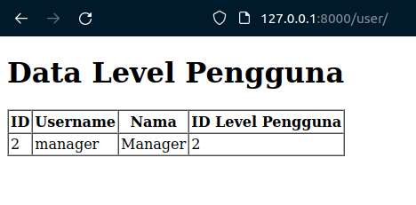<br>
    > Tidak ada perubahan pada database karena data sudah ketemu, sehingga tidak perlu create.
4. Ubah file controller dengan nama UserController.php dan ubah script seperti gambar
   di bawah ini <br>

```php
namespace App\Http\Controllers;

use Illuminate\Http\Request;
use App\Models\User;
use Illuminate\Support\Facades\Hash;

class UserController extends Controller
{
    function index()
    {
        $user = UserModel::firstOrCreate([
            'username' => 'manager22',
            'nama' => 'Manager Dua Dua',
            'password' => Hash::make('1234'),
            'level_id' => 2
        ]);
        return view('user', ['data' => $user]);
    }
}
```

5. Simpan kode program Langkah 4. Kemudian jalankan pada browser dan amati apa yang
   terjadi dan cek juga pada phpMyAdmin pada tabel m_user serta beri penjelasan dalam
   laporan <br>
   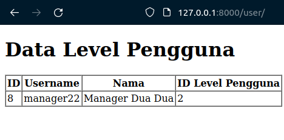<br>
   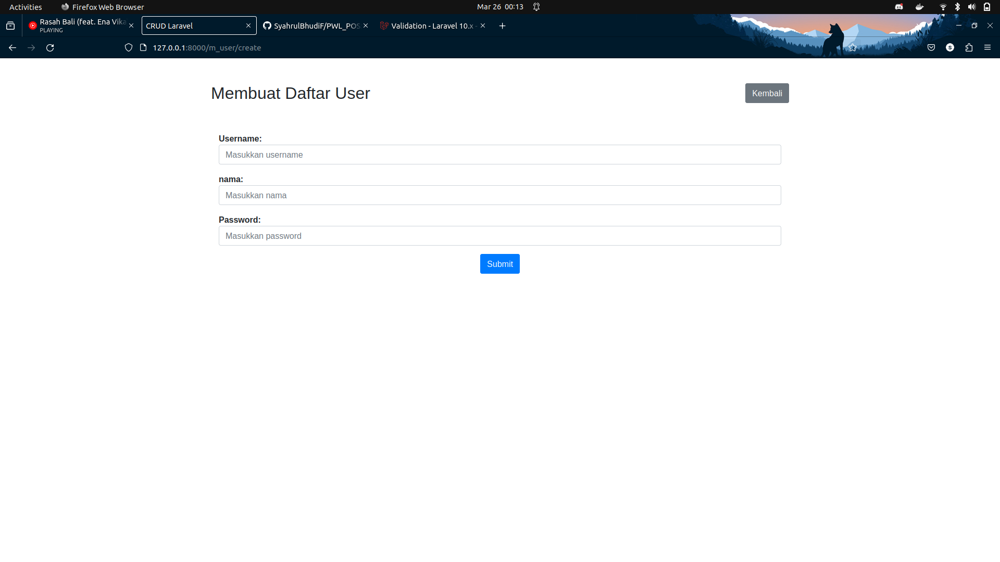<br>
    > Akan dibuat record baru dikarenakan find tidak bisa ditemukan
6. Ubah file controller dengan nama UserController.php dan ubah script seperti gambar
   di bawah ini

```php
namespace App\Http\Controllers;

use Illuminate\Http\Request;
use App\Models\User;
use Illuminate\Support\Facades\Hash;

class UserController extends Controller
{
    function index()
    {
        $user = UserModel::firstOrNew([
            'username' => 'manager',
            'nama' => 'Manager',
        ]);
        return view('user', ['data' => $user]);
    }
}
```

7. Simpan kode program Langkah 6. Kemudian jalankan pada browser dan amati apa yang
   terjadi dan beri penjelasan dalam laporan <br>
   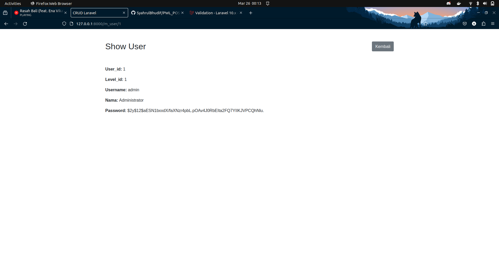<br>
    > Karena data ditemukan maka tidak akan membuat sebuah record dan tidak harus di save()
8. Ubah file controller dengan nama UserController.php dan ubah script seperti gambar
   di bawah ini

```php
namespace App\Http\Controllers;

use Illuminate\Http\Request;
use App\Models\User;
use Illuminate\Support\Facades\Hash;

class UserController extends Controller
{
    function index()
    {
        $user = UserModel::firstOrNew([
            'username' => 'manager33',
            'nama' => 'Manager Tiga Tiga',
            'password' => Hash::make('12345'),
            'level_id' => 2
        ]);
        return view('user', ['data' => $user]);
    }
}
```

9. Simpan kode program Langkah 8. Kemudian jalankan pada browser dan amati apa yang
   terjadi dan cek juga pada phpMyAdmin pada tabel m_user serta beri penjelasan dalam
   laporan <br>
   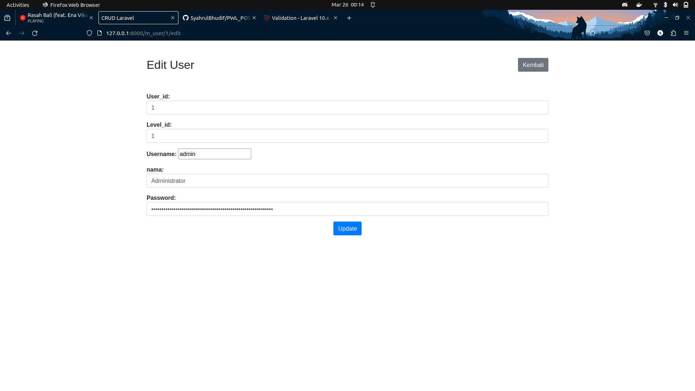<br>
   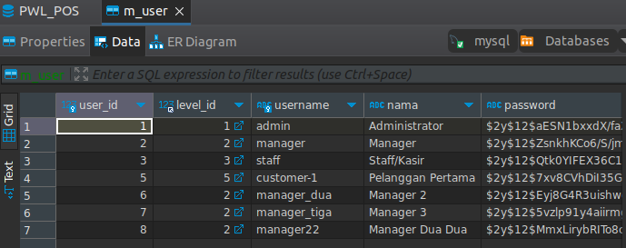<br>
    > data akan tampil tetapi tidak disimpan kedalam database
10. Ubah file controller dengan nama UserController.php dan ubah script seperti gambar
    di bawah ini

```php
namespace App\Http\Controllers;

use Illuminate\Http\Request;
use App\Models\User;
use Illuminate\Support\Facades\Hash;

class UserController extends Controller
{
    function index()
    {
        $user = UserModel::firstOrNew([
            'username' => 'manager33',
            'nama' => 'Manager Tiga Tiga',
            'password' => Hash::make('12345'),
            'level_id' => 2
        ]);
        $user->save();

        return view('user', ['data' => $user]);
    }
}
```

11. Simpan kode program Langkah 9. Kemudian jalankan pada browser dan amati apa yang
    terjadi dan cek juga pada phpMyAdmin pada tabel m_user serta beri penjelasan dalam
    laporan <br>
    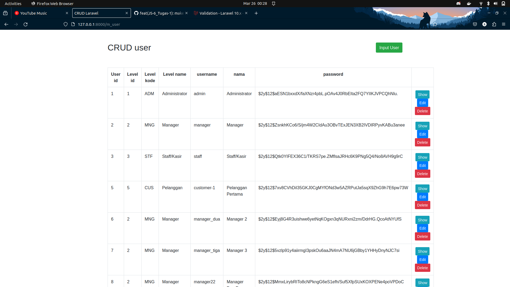<br>
    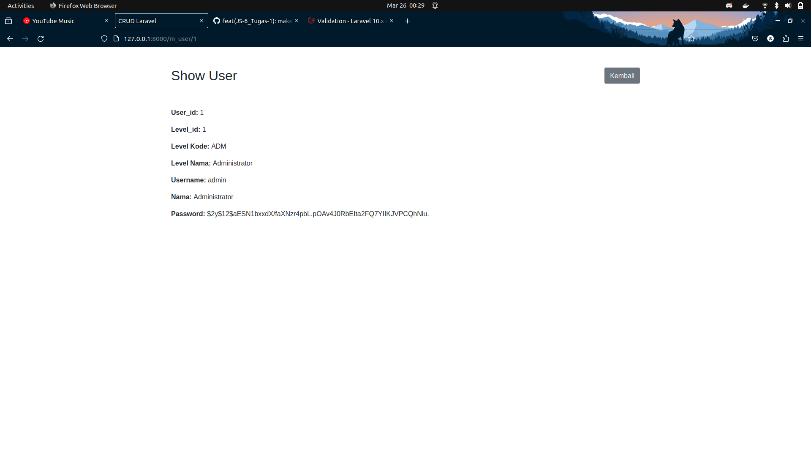<br>
    > Hasil seperti diatas, terdapat ID dan ada record baru di database. Dikarenakan fungsi save() digunakan untuk membuat record baru.
