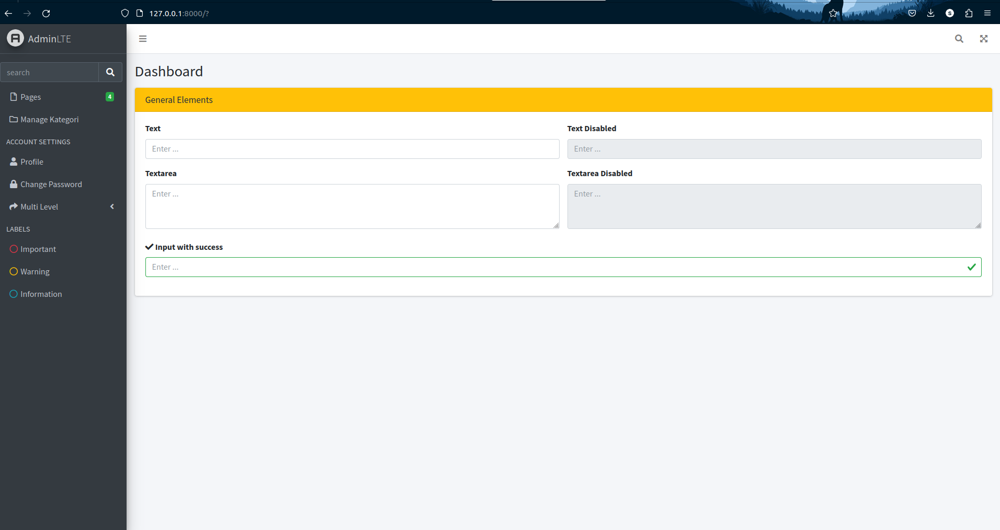

# JOBSHEET 6 - Template Form (AdminLTE), Server Validation, Client Validation, CRUD

> Nama : Ahmad Aria Adi Saputra <br>
> NIM : 2241720247 <br>
> Kelas / No. : TI-2H / 02

## A. Template Form (AdminLTE)

<br>
<br>

<!-- ## B. VALIDASI PADA SERVER
-   Validasi <br>
```php
    function store(Request $request) {
        $validator = Validator::make($request->all(), [
            'kodeKategori' => 'required',
            'namaKategori' => 'required',
        ]);
        if ($validator->fails()) {
            return redirect('/kategori/create')
                ->withErrors($validator)
                ->withInput();
        }
        Kategori::create([
            'kategori_kode' => $request->kodeKategori,
            'kategori_nama' => $request->namaKategori,
        ]);
        return redirect('/kategori');
    }
```
- Tulis perbedaan penggunaan validate dengan validateWithBag!
>Metode validate() langsung menangani validasi data dari permintaan dan mengembalikan respons kesalahan yang telah ditetapkan jika validasi gagal, sedangkan metode validateWithBag() memungkinkan untuk menetapkan pesan kesalahan ke "tas" yang dapat diatur sendiri, memberikan lebih banyak kendali atas bagaimana pesan kesalahan tersebut ditampilkan atau diproses. -->
