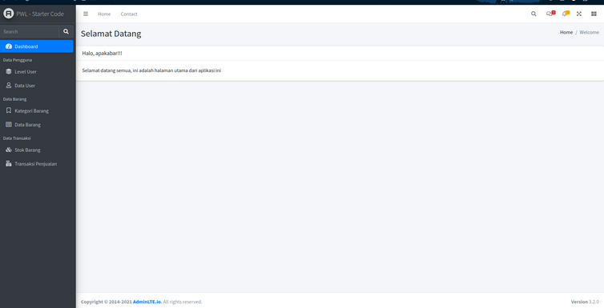

# JOBSHEET 7 - LARAVEL STARTER CODE
> Nama : Ahmad Aria Adi Saputra <br>
> NIM : 2241720247 <br>
> Kelas / No. : TI-2H / 02

## A. Layouting AdminLTE
- Hasil akhir template.blade.php<br>

## B. Penerapan Layouting
- Welcome Controller
```php
<?php

namespace App\Http\Controllers;

use Illuminate\Http\Request;

class WelcomeController extends Controller
{
    function index()
    {
        $breadcrumb = (object) [
            'title' => 'Selamat Datang',
            'list' => ['Home', 'Welcome']
        ];

        $activeMenu = 'dashboard';

        return view('welcome', ['breadcrumb' => $breadcrumb, 'activeMenu' => $activeMenu]);
	}
}
```
- Welcome.blade 
```php
@extends('layouts.template')

@section('content')
    <div class="card">
        <div class="card-header">
            <h3 class="card-title">Halo, apakabar!!!</h3>
            <div class="card-tools"></div>
        </div>
        <div class="card-body">
            Selamat datang semua, ini adalah halaman utama dari aplikasi ini
        </div>
    </div>
@endsection
```
- Modifikasi breadcrumb blade
```php
<section class="content-header">
    <div class="container-fluid">
        <div class="row mb-2">
            <div class="col-sm-6">
                <h1>{{$breadcrumb->title}}</h1>
            </div>
            <div class="col-sm-6">
                <ol class="breadcrumb float-sm-right">
                    @foreach($breadcrumb->list as $key => $value)
                        @if($key == count($breadcrumb->list - 1))
                            <li class="breadcrumb-item active">{{$value}}</li>
                        @else
                            <li class="breadcrumb-item">{{$value}}</li>
                        @endif
                    @endforeach
                </ol>
            </div>
        </div>
    </div><!-- /.container-fluid -->
</section>
```
- Hasil <br>
<br>

-
