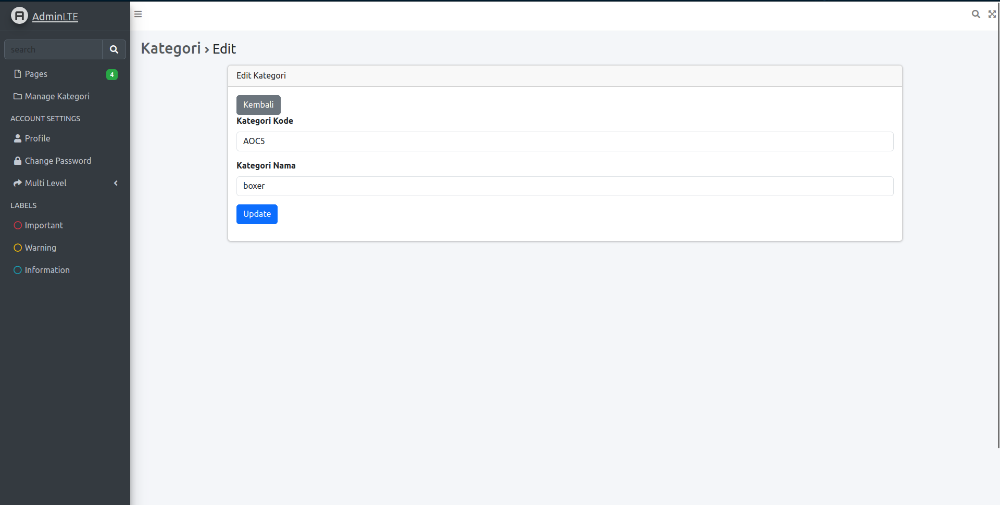
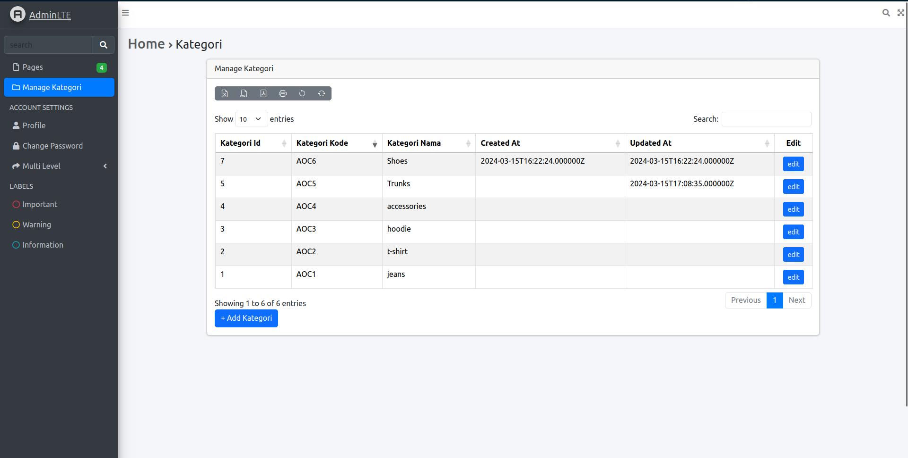
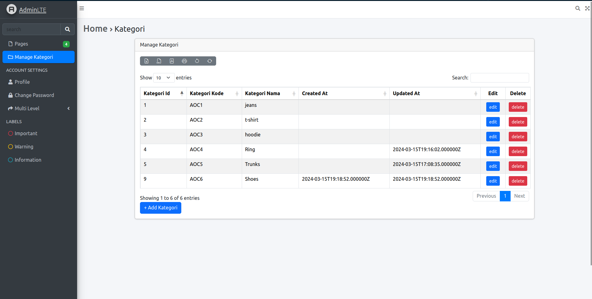
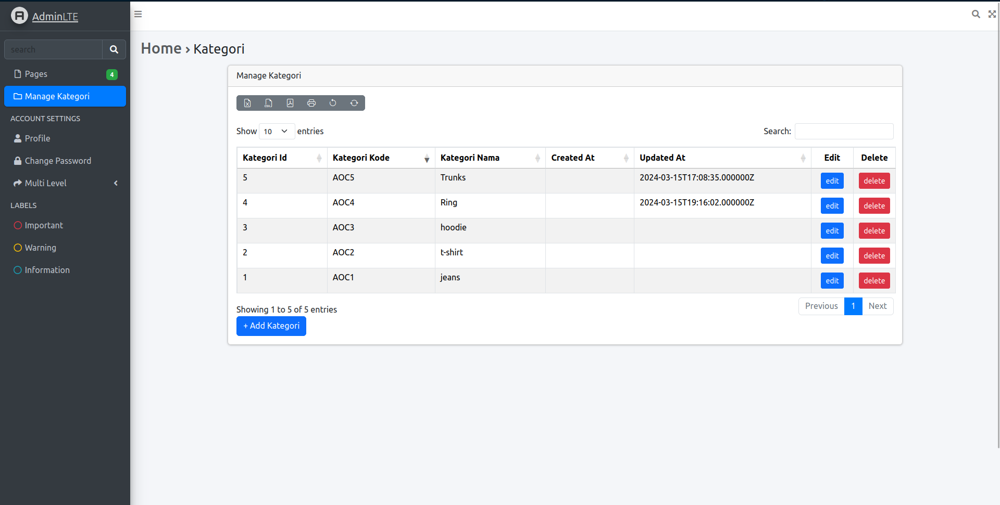

# JOBSHEET 5 - Blade View, Web Templating(AdminLTE), Datatables

> Nama : Ahmad Aria Adi Saputra <br>
> NIM : 2241720247 <br>
> Kelas / No. : TI-2H / 02

## 1. Tambahkan button Add di halam manage kategori, yang mengarah ke create kategori baru

```php
<a class="btn btn-Primary" href="/kategori/create">+ Tambah Kategori</a>
```


## 2. Tambahkan menu untuk halaman manage kategori, di daftar menu navbar

```php
        [
            'text' => 'Manage Kategori',
            'url' => 'kategori',
            'icon' => 'far fa-fw fa-folder',
        ],
```

## 3. Tambahkan action edit di datatables dan buat halaman edit serta controllernya

-   halaman awal<br>
    <br>
-   Edit
    <br>
-   Hasil
    <br>

## 4. Tambahkan action delete di datatables serta controllernya

-   halaman awal<br>
    
-   Hasil <br>
    
